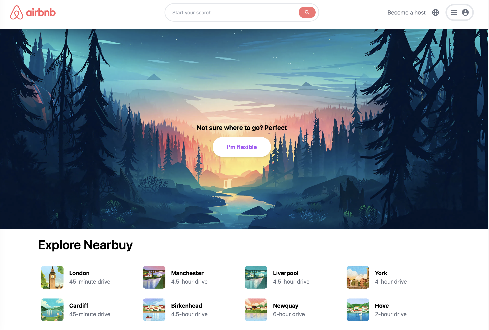

# Airbnb Clone



This project is a web app that aims to provide users with a platform to find, book and rent accommodations all over the world, similar to **Airbnb**. The project is built using **Next.js, a and Tailwind CSS**.

## Table of Contents

- [Features](#features)
- [Installation and Usage](#installation-and-usage)
- [Contributing](#contributing)
- [License](#license)

### Features

The Airbnb clone has the following features:

- Home page with a search form and popular destinations .
- Search results page that displays a list of accommodations matching the search criteria .
- Integration with external APIs, such as **Mapbox** for displaying maps and geolocation data 
- Responsive design and mobile-friendly interface, optimized for various screen sizes and devices

### Installation and Usage

To install and use the Airbnb clone on your local machine, follow these steps:

1. Clone the repository using the following command:

```bash
git clone https://github.com/arunavabasu-03/airbnb-clone.git
```

2. Install the dependencies using `npm install`

3. Create a Mapbox account and generate a Mapbox API key

3. Create a .env.local file in the root directory of the project and add the following environment variables:

```bash
mapbox_key = <MAPBOX KEY>
```
### Contributing
If you would like to contribute to the project, feel free to fork the repository and make changes as you see fit. You can then submit a pull request to have your changes reviewed and potentially merged into the main branch.

### License
This project is licensed under the [MIT License](https://github.com/arunavabasu-03/airbnb-clone/blob/dev/LICENSE). See the LICENSE file for details.


